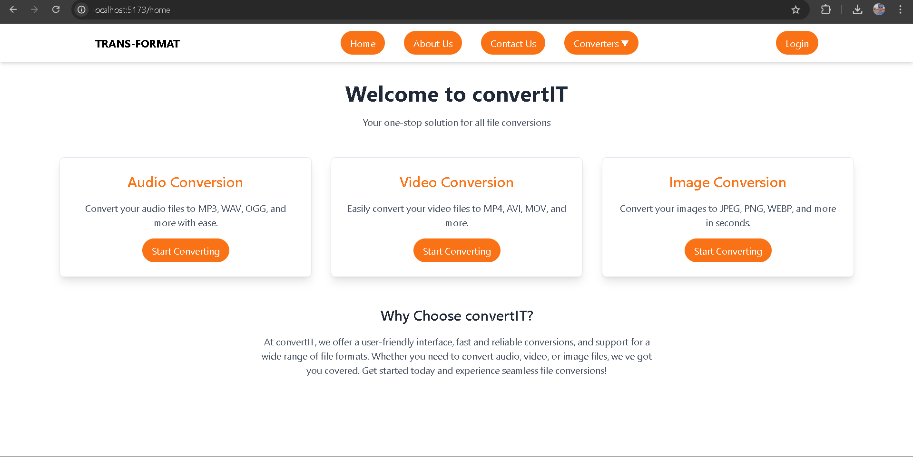

# TRANS-FORMAT

TRANS-FORMAT is a cutting-edge web application for converting images, audio, and video files to various formats effortlessly. Built with a robust backend using Node.js, Express, FFmpeg, and Sharp, and a sleek frontend powered by React, TRANS-FORMAT ensures high-quality conversions with a user-friendly interface.



## Features

 - Image Conversion: Convert images to different formats (e.g., PNG, JPG).
 - Audio Conversion: Convert audio files to different formats (e.g., MP3, WAV).
 - Video Conversion: Convert video files to different formats (e.g., MP4, AVI).
 - User Authentication: Secure user login with Google OAuth.


## Tech

TRANS-FORMAT uses a number of open source projects to work properly:

- [React] - A JavaScript library for building user interfaces
- [Axios] - Promise-based HTTP client for the browser and Node.js
- [Tailwind CSS] - A utility-first CSS framework for rapid UI development
- [Node.js] - Event-driven I/O for the backend
- [Express] - Fast, unopinionated, minimalist web framework for Node.js
- [Multer] - Node.js middleware for handling `multipart/form-data`
- [Sharp] - High-performance Node.js image processing
- [FFmpeg] - A complete, cross-platform solution to record, convert, and stream audio and video
- [Passport.js] - Simple, unobtrusive authentication for Node.js
- [dotenv] - Loads environment variables from a `.env` file into `process.env`


## Installation


Install the dependencies and devDependencies and start the server.

```sh
git clone https://github.com/swapnilpatil-github/TRANS-FORMAT.git
cd TRANS-FORMAT
cd Backend
npm install
cd ../Frontend
npm install
```

Set Up Environment Variables:
  Create a .env file in the Backend directory:

```sh
SESSION_SECRET=your-session-secret
GOOGLE_CLIENT_ID=your-google-client-id
GOOGLE_CLIENT_SECRET=your-google-client-secret

```
Start the Backend Server:
```sh
cd Backend
npm start

```
Start the Frontend Server:
```sh
cd ../Frontend
npm start

```

## License

Licensed under the MIT License.
## Contact
Gmail : ehswapnilpatil@gmail.com
